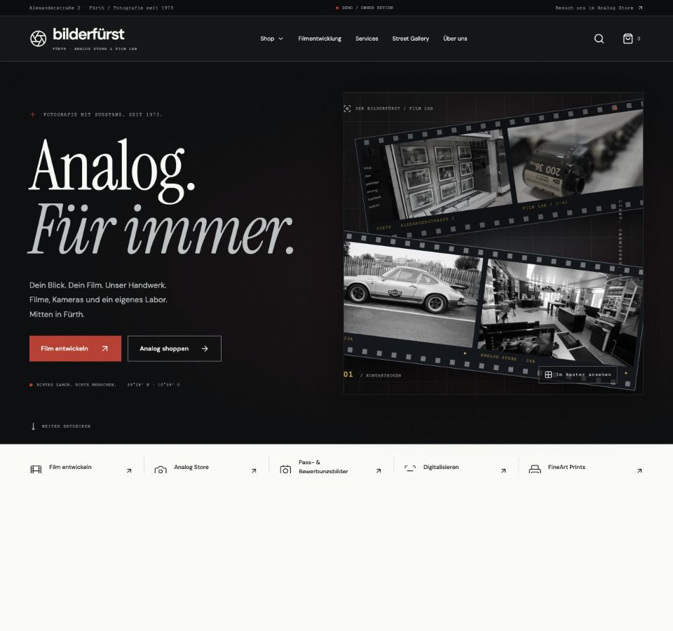
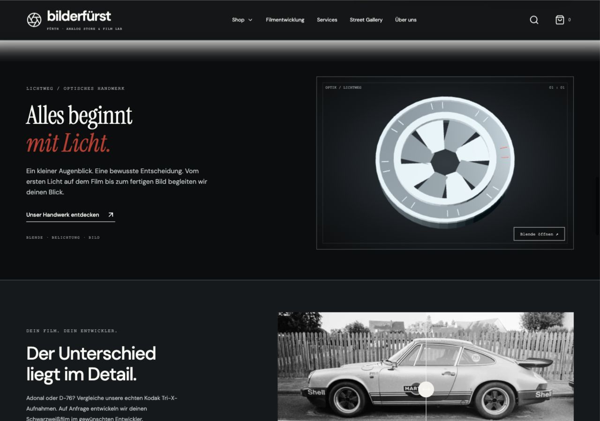

# Bilderfürst · Final visual transformation report

Visual release prepared 05 October 2026. Baseline: `c11e784`, tagged `visual-baseline-2026-10-05` and `pre-higgsfield-2026-10-05`. This remains a public **DEMO / OWNER REVIEW**, with noindex/nofollow, dated catalog and disabled payment.

The rendered result uses the real shop, laboratory, products and developer samples as its visual anchor. Higgsfield adds six clearly stylized optical/media illustrations. The source catalog, service/legal content records and original image files have no changes in this release.

## Required 32-point review

| # | Area | Result |
|---|---|---|
| 1 | Baseline audit | Recorded before editing in [FINAL-VISUAL-AUDIT.md](FINAL-VISUAL-AUDIT.md), with 65 route/width observations and matching screenshots. Optimized build, TypeScript and catalog verification passed. No lint script existed. |
| 2 | Problems found | Repetitive pale splits, olive dark surfaces, universal terracotta, overly similar serif headings, flat digitization and service cards, empty archive space, and a mobile filter that lacked a native modal boundary. |
| 3 | Old palette | Paper #F5F3EC, ink #1B1D17, muted #777A6F and orange #DC4D22, with olive/khaki surfaces. |
| 4 | New palette | Black #0B0D0E, graphite #15191C, panel #1D2225, print #FAFAF7, paper #F4F3EE, silver #BBC1C2, safelight red #C6322A, scanner cyan #55BCC0 and film amber #D6A541. |
| 5 | Palette evidence | Genuine shop-front, interior, film-roll and scanner photographs were sampled in [source-palette.json](evidence/visual-before/source-palette.json). Black equipment, silver hardware, white photographic mats and localized film amber motivate this designed palette. It is not presented as the official brand palette. |
| 6 | Typography | Retained local DM Sans, Instrument Serif and technical mono. Emotional hero/history/gallery keep serif; shop, configurator, product and service controls have a clearer sans hierarchy. |
| 7 | Hero | Full-width darkroom surface, silver headline, red safelight accents, real contact-sheet photographs, shallow photographic depth and reversible Anime grid choreography. Original hero copy and destinations remain. |
| 8 | Vanta | FOG in the hero, optional DOTS in the digitization introduction; dynamically loaded, observed and destroyed outside view. No Vanta scene in shop or checkout. |
| 9 | Vanta settings | FOG: highlight 0x5B2429, midtone 0x202A30, lowlight 0x080B0E, base 0x0B0D0E, blur .65, speed .22, zoom 1.2, scale 2.5. DOTS: background 0x0B0D0E, colors 0x35595C/0x55BCC0, size 1.1, spacing 42, no lines. Pointer/gyro control disabled. DPR divided by 2.5 and capped at 1.5. Static below 768px, reduced motion, data saving, hidden document or unavailable renderer. |
| 10 | Anime architecture | Scoped modules in `motion/`: shared tokens, hero, commerce, photographic actions and the deferred prop scene. Cleanup belongs to each component. Aceternity retains its internal Motion ownership; Vanta owns atmosphere. |
| 11 | Added motion | Film/contact layout, a one-pass scanner line, film advancement by selection, archive/sample development, image shutter entrance, native dialog entrance, bounded first-four product feedback, aperture open/close and small pointer tilt on generic props. |
| 12 | Removed motion | Generic section fade-up treatment; unbounded camera-card angles; olive/brown atmosphere; generic universal orange styling. No perpetual prop spin, product-grid parallax, sparkles or fake restoration morph. |
| 13 | Aceternity installed | Existing six official registry-derived components retained: Spotlight New, Lens, Compare, Tracing Beam, Parallax Scroll and 3D Card. No duplicate package added. |
| 14 | Component usage | Spotlight behind hero photographs; Lens on real product/sample images; Compare on actual Adonal/D-76 samples; history beam; illuminated gallery parallax; actual Pentax photograph card, bounded to 5 degrees. |
| 15 | Rejected components | Card Spotlight, Animated Modal, Parallax Hero Images, Focus Cards, Container Scroll, aurora/stars/meteors: duplicate behavior or lack photographic purpose. [Decision table](ACETERNITY-PLAN.md). |
| 16 | Shop | Neutral light-table product stages, sticky technical filters, removable chips, quiet first-row feedback, visible source availability and calm typography. Search/filter/sort logic retains the real catalog. |
| 17 | Film development | Film-format strip with process colors and step feedback, chemistry marks, clearer sans steps and persistent real variant summary. Exact 35mm C-41/JPG €12, 110 C-41/TIFF €30 and 110 S/W/TIFF €35 verified. Unavailable 110 E-6 and Push/Pull are absent. |
| 18 | Digitization | Cyan scanner identity, original Noritsu source photo, one scan pass, four physical-medium choices and a matching generic 3D prop. Original format descriptions and links remain; no invented restored output. |
| 19 | Gallery | Photographic black, white mats, silver illuminated frames, restrained desktop parallax and native shutter lightbox. Source samples are explicitly labelled as a concept, not the current exhibition. Static on touch/reduced motion. |
| 20 | History | Real archive photo develops once, dates use technical mono and milestones sit in perforated film frames. A generic negative illustration fills the visual column without impersonating an archive artifact. Existing facts remain. |
| 21 | Services | A neutral portrait framing guide and generic print stack give the cards physical identity. Real service prices, Calenso destination and telephone links remain; no biometric validation or fabricated portrait claim. |
| 22 | Product pages | Real photography, Lens plus accessible native lightbox, technical metadata chips from existing fields, stronger sans titles and neutral stage. Unavailable products remain disabled. No generated camera mesh substitutes a product. |
| 23 | Search | Analog archive heading, real format/ISO/availability metadata, native dialog, Cmd/Ctrl-K entry, Escape and focus restoration. Real Portra search verified. |
| 24 | Cart | Calm drawer entrance, readable exact variant, quantity updates, removal, source purchase links and visible review boundary. €35 × 2 = €70 verified. No order or payment behavior added. |
| 25 | Mobile | Native bottom filter dialog, native navigation, two-column catalog, bounded typography, static 3D posters and no mobile Vanta. A film-strip min-content overflow was found and fixed before handoff. |
| 26 | Accessibility | 65 layouts have one H1, no horizontal overflow and no broken loaded images. Native dialogs, keyboard controls, focus return, labelled comparison range and disabled checkout verified. Key contrast ratios: primary 5.16:1, muted body 5.28:1, dark body 10.69:1, cyan button 8.66:1, amber metadata 7.85:1. Red on black 3.61:1 is used for large display type. These checks are not a full WCAG certification. |
| 27 | Reduced motion | Live preference change destroys the active prop and restores its poster; hero remains visible with zero canvas. CSS removes transitions/scanning/film transforms. Gallery/card/lens alternatives remain usable. |
| 28 | Performance delta | Across all emitted production chunks: JS 1,911,891 → 1,999,331 bytes (+87,440; 4.57%); CSS 61,613 → 86,252 (+24,639). Individually gzipped JS 515,070 → 539,708; CSS 13,116 → 17,958. These totals are not initial page-transfer sizes or Core Web Vitals. |
| 29 | WebGL performance | Deferred desktop GLB 589,592 bytes; all six static WebPs total 56,750 bytes. Props render on demand and dispose renderer/materials/geometries/context on exit. Vanta disposal also closes its context. Shop network observation requested no Vanta/Three/GLTF chunks or GLB and had zero canvases. Digitization can have two simultaneous contexts where its intro and prop overlap. CPU-throttled selection and blocked-GLB fallback pass. No FPS, GPU-memory or physical low-end-device benchmark is claimed. |
| 30 | Owner approvals | Approved standalone logo, photo/gallery/sample usage, current source contradictions, real commerce adapter, live tax/shipping/stock/payment and sandbox order acceptance remain in [OWNER-CONFIRMATION-LIST.md](OWNER-CONFIRMATION-LIST.md). Existing public review authorization remains valid; this update does not enable commerce. |
| 31 | Screenshots | [Before](evidence/visual-before/) and [after](evidence/visual-after/) cover home, shop, film, digitization, services, gallery, history, contact and Pentax at 360/390/430/768/1024/1280/1440, plus lab, FineArt, search/cart, mobile filters/menu, grid, aperture and fallback. The loaded homepage capture checks all 29 images. Other full-page captures may omit offscreen lazy images; they are not treated as image-failure evidence. |
| 32 | Recommendations | Obtain a standalone approved logo: the original banner mixes branding with hours/address/contact, so it was not repurposed as a logo. Get approved current gallery and restoration pairs. Use physical iOS/Android and low-end GPU testing before a commerce launch. Actual hidden-tab/reopen lifecycle and long-session GPU profiling remain manual device checks; visibility teardown is implemented. Keep the current review gates until production commerce is accepted. |

## Higgsfield delivery

Created through the explicitly selected **Higgsfield** plugin, using 3D Jutsu: [editable project](https://higgsfield.ai/3d-jutsu/9e1fa240-ae3d-49dd-b6f6-dc114bfbfd63), committed revision **1**, scene sequence **0**.

Six roots: Aperture, Reel, Cassette, VHS, Negative and Prints. All are unbranded stylized metaphors. Negative/print frames contain no invented photography. The aperture has an eight-blade, 60-frame opening/closing cycle at 24fps; the site plays it for 1400ms on entry or explicit replay. Mouse tilt is approximately 3.4 degrees and has no permanent render loop.

- Portable model: [analog-craft.glb](../public/props/analog-craft.glb).
- Editable source: [analog-craft.blend](evidence/higgsfield/analog-craft.blend).
- Procedural source and exact artifact provenance: [Higgsfield evidence](evidence/higgsfield/).
- Six native 400×300 Eevee transparent posters were rendered, inspected and converted to WebP. A combined high-cost render originally timed out; splitting the committed model export from smaller queries resolved it. This limitation is recorded, not represented as a successful high-resolution render.
- Higgsfield posters/GLB are additions. Original merchant photos and catalog data were not replaced.

## Verification evidence

Final optimized build, TypeScript, ESLint syntax/hooks check and catalog verifier pass. Production dependency audit: zero vulnerabilities. ESLint is configured with the TypeScript parser and React Hooks rules; it is not described as a full Next-specific lint or accessibility suite.

[Route sweep](evidence/visual-after/route-qa.json): **189/189** HTTP routes, one H1, review noindex and meaningful content. [Responsive observations](evidence/visual-after/layout.json): **65/65**. [Interaction observations](evidence/visual-after/interactions.json): **37/37**. Final local production browser diagnostics contain no captured errors/warnings. The prior CLI browser runner is preserved as historical evidence; this release used direct browser verification.

Browser emulation for reduced motion, CPU throttling, cache bypass and blocked assets was reset after testing. Local source verification is distinct from the final Vercel deployment check, which is performed after publishing the release.

